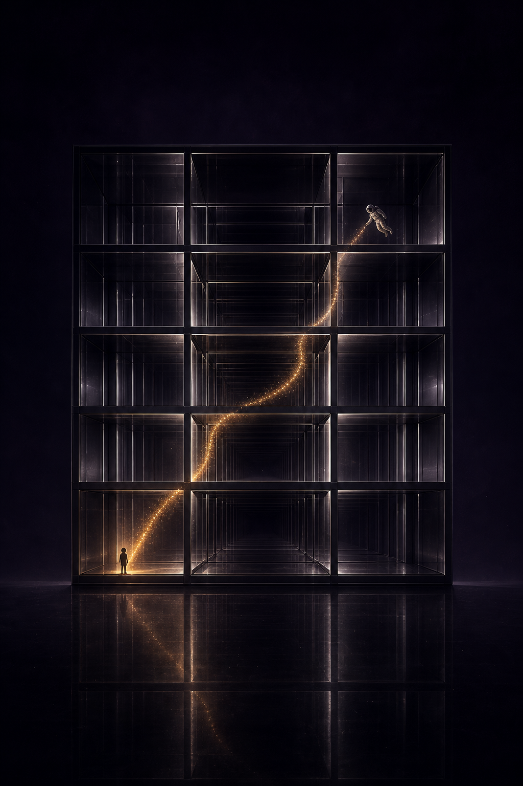
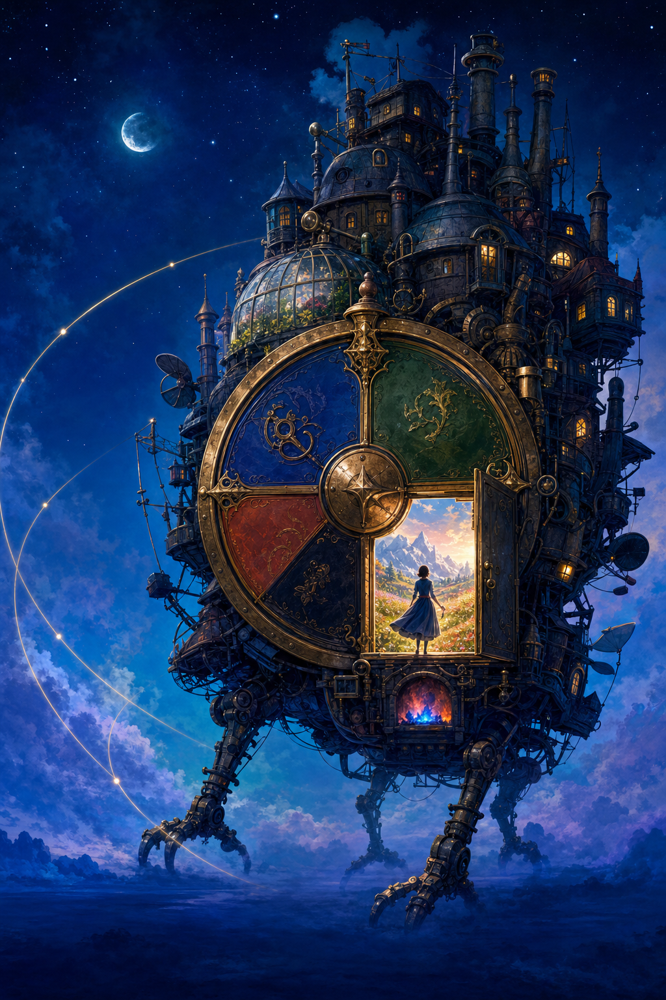
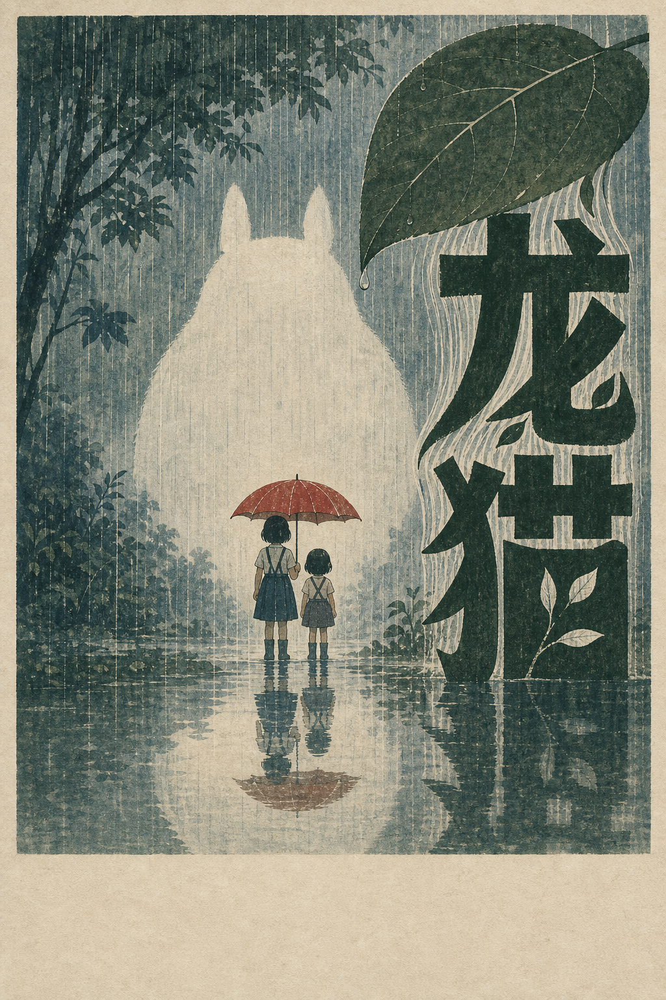
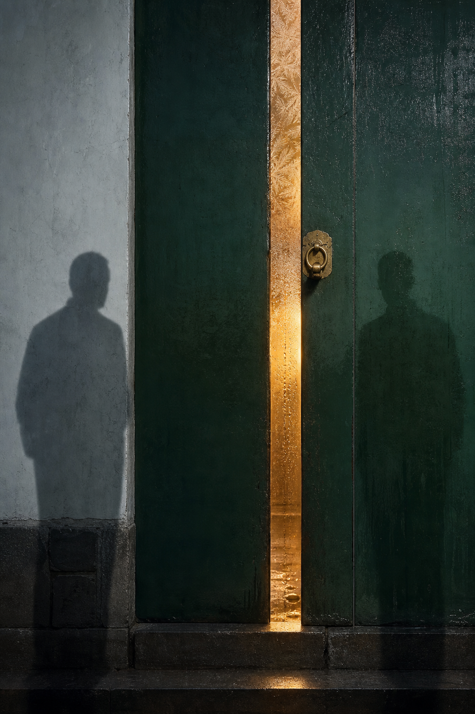

# Cinematic Portrait Poster

一个用于 Codex 的电影海报设计 Skill。它从影片叙事出发，完成概念提炼、视觉隐喻、主视觉生成、片名设计、演职员排版和最终成品校验。

这个 Skill 的重点不是套用固定模板，而是让每张海报拥有与影片内容对应的空间、材质、色彩和文字结构。

## 作品展示

以下示例展示同一套海报工作流在科幻、奇幻、动画、年代谍战与黑色喜剧题材中的视觉变化。图片均为 2:3 竖版主视觉或概念海报。

<table>
  <tr>
    <td align="center" width="50%">
      
      <br><strong>《星际穿越》</strong>
      <br>重力书架与跨越时间的金色轨迹
    </td>
    <td align="center" width="50%">
      
      <br><strong>《盗梦空间》</strong>
      <br>由一枚红色意念支撑的倒悬梦境
    </td>
  </tr>
  <tr>
    <td align="center" width="50%">
      
      <br><strong>《哈尔的移动城堡》</strong>
      <br>以魔法罗盘为心脏的机械城堡
    </td>
    <td align="center" width="50%">
      
      <br><strong>《龙猫》</strong>
      <br>雨幕、树叶与负形共同构成片名
    </td>
  </tr>
  <tr>
    <td align="center" width="50%">
      
      <br><strong>《抓特务》</strong>
      <br>一线门光分隔两名潜伏者的影子
    </td>
    <td align="center" width="50%">
      
      <br><strong>《让子弹飞》</strong>
      <br>让子弹、铁轨与片名共享同一动势
    </td>
  </tr>
</table>

## 主要能力

- 从片名、剧情、剧本或角色简介中提炼叙事 DNA。
- 提供 Symbol、Evidence、Structure 三种不同的概念方向。
- 根据故事证据选择画面材质，避免默认使用牛皮纸、旧报纸和仿古纹理。
- 支持 2:3 电影海报，以及可扩展的 3:4、9:16 版本。
- 支持三种片名制作方式：
  - `Native expressive`：让短片名直接生成在主视觉中。
  - `Native controlled`：生成受控的片名主视觉，再确定性加入事实文字。
  - `Deterministic exact`：生成无文字主视觉，再用脚本精确排印片名。
- 支持片名结构效果：
  - 运动断带 `split_chalk`
  - 雨幕树冠 `rain_canopy`
  - 笔画建筑 `stroke_architecture`
  - 负形窗口 `negative_window`
  - 单次切割 `interrupt_cut`
  - 浅浮雕压印 `relief_press`
  - 轮廓回声 `outline_echo`
  - 镜面消隐 `mirror_fade`
- 将导演、主演和事实演职信息设计成完整的第二视觉系统。
- 对片名、演职员来源、字号、留白、安全边距和材质声明进行最终校验。

## 安装

### Windows

```powershell
git clone https://github.com/zhu930824/cinematic-portrait-poster.git `
  "$env:USERPROFILE\.codex\skills\cinematic-portrait-poster"
```

### macOS / Linux

```bash
git clone https://github.com/zhu930824/cinematic-portrait-poster.git \
  ~/.codex/skills/cinematic-portrait-poster
```

重新打开 Codex 后即可使用。

## 使用方式

在 Codex 中直接调用：

```text
$cinematic-portrait-poster 帮我为电影《龙猫》设计一张电影海报
```

也可以给出更完整的要求：

```text
$cinematic-portrait-poster
为《功夫女足》制作一张 2:3 主海报。
画面更抽象，不使用明星肖像；
片名必须参与整体构图；
导演和主要演员需要清晰可读。
```

如果提供了参考海报或设计师作品，Skill 会提取高层设计原则，例如象征压缩、负空间、尺度反差和材质关系，而不会在生成提示词中要求复制在世艺术家的具体风格。

## 工作流程

1. 核实正式片名、导演、编剧和主要演员。
2. 提炼影片的核心冲突、情绪和主要视觉证据。
3. 建立空间、尺度、材质、色彩与字体规则。
4. 提出三套结构不同的海报概念并选择最强方向。
5. 生成无文字主视觉或带受控片名的主视觉。
6. 使用确定性脚本加入精确片名和演职员信息。
7. 在全尺寸、缩略图和手机宽度下检查可读性。
8. 使用 `--final` 执行交付校验。

## 演职员排版

最终海报包含三个明确层级：

- `creator_credit`：导演或编剧的作者签名，作为视觉入口或平衡点。
- `verified_cast`：主要演员姓名形成可读的节奏、路径或空间轴。
- `verified_credits`：带角色标签的事实信息，形成门槛、基线或证据结构。

导演和主要演员不会只出现在底部小字中。默认字号下限按照画布宽度计算，并通过手机宽度预览检查可读性。

所有姓名和职务必须来自用户确认的信息或可靠来源。Skill 不会为了让海报“看起来更正式”而虚构制片公司、奖项、上映日期或演员。

## 精确排版脚本

安装依赖：

```bash
python -m pip install Pillow
```

生成最终海报：

```bash
python scripts/compose_poster.py \
  --background path/to/key-art.png \
  --layout path/to/layout.json \
  --output path/to/poster-final.png \
  --final
```

Windows PowerShell 示例：

```powershell
python scripts\compose_poster.py `
  --background outputs\example\key-art.png `
  --layout outputs\example\layout.json `
  --output outputs\example\poster-final.png `
  --final
```

`layout.json` 使用相对于画布宽高的归一化坐标。示例文件位于：

```text
assets/layout-example.json
```

最终模式会检查：

- 是否包含精确片名或已经人工验证的图生片名。
- 是否包含导演、主要演员和事实演职信息三个层级。
- 演职员字号是否达到最低可读标准。
- 是否记录事实信息来源。
- 材质、色彩与静区是否有影片依据。
- 纸张和做旧效果是否提供了明确的故事证据。
- 是否残留占位文字。

## 项目结构

```text
cinematic-portrait-poster/
├─ SKILL.md                         # Skill 主工作流
├─ README.md                        # 中文使用说明
├─ agents/
│  └─ openai.yaml                  # Codex 展示与默认提示
├─ assets/
│  └─ layout-example.json          # 排版配置示例
├─ references/
│  ├─ narrative-analysis.md        # 叙事分析
│  ├─ metaphor-grammar.md          # 隐喻语法
│  ├─ art-direction-routing.md     # 艺术方向与减法优化
│  ├─ material-palette-routing.md  # 材质和色彩路由
│  ├─ composition-recipes.md       # 构图方案
│  ├─ title-design-patterns.md     # 片名结构设计
│  ├─ image-native-title-workflow.md
│  ├─ typography.md
│  ├─ credit-typography.md
│  └─ quality-gate.md              # 最终质量门槛
└─ scripts/
   └─ compose_poster.py            # 精确文字合成与校验
```

## 设计原则

- 先有影片证据，再选择材质。
- 一张海报只有一个主要视觉机制。
- 片名必须参与构图，而不是放进剩余角落。
- 文字设计可以有变化，但不能牺牲片名和人名的准确性。
- 导演与主演信息需要参与平衡、方向或节奏。
- 参考优秀作品时学习方法，不复制可识别的构图与风格签名。
- 优先删除无关装饰，再增加新的视觉元素。
